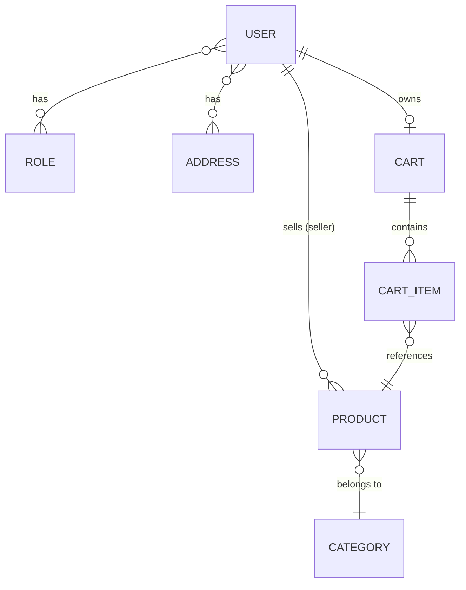

# 🛒 Spring Boot E-Commerce API

A full-featured RESTful e-commerce backend built with **Spring Boot 4.1**, featuring JWT cookie-based authentication, role-based access control, product catalog management, and shopping cart functionality.

---

## 📋 Table of Contents

- [Tech Stack](#-tech-stack)
- [Architecture](#-architecture)
- [Getting Started](#-getting-started)
- [Authentication](#-authentication)
- [API Endpoints](#-api-endpoints)
  - [Auth](#auth-endpoints)
  - [Categories](#category-endpoints)
  - [Products](#product-endpoints)
  - [Cart](#cart-endpoints)
- [Data Models](#-data-models)
- [Security](#-security)
- [Default Users](#-default-users)
- [Front-End Routing Strategy](#-front-end-routing-strategy)
- [Endpoint Issues & Recommendations](#-endpoint-issues--recommendations)

---

## 🧰 Tech Stack

| Layer          | Technology                           |
|----------------|--------------------------------------|
| Framework      | Spring Boot 4.1.0                    |
| Language       | Java 21                              |
| Database       | H2 (in-memory)                       |
| ORM            | Spring Data JPA / Hibernate          |
| Security       | Spring Security + JWT (jjwt 0.13.0)  |
| Validation     | Jakarta Bean Validation              |
| Mapping        | ModelMapper 3.2.4                    |
| Build Tool     | Maven                                |
| Utilities      | Lombok                               |

---

## 🏗 Architecture

```
com.ecommerce.project
├── config/             # AppConfig, AppConstants
├── controller/         # REST controllers (Auth, Cart, Category, Product)
├── enums/              # AppRole enum (USER, SELLER, ADMIN)
├── exceptions/         # Custom exceptions & global handler
├── model/              # JPA entities (User, Product, Category, Cart, CartItem, Address, Role)
├── payload/            # DTOs & response wrappers
├── repositories/       # Spring Data JPA repositories
├── security/
│   ├── jwt/            # JWT utility, token filter, auth entry point
│   ├── requests/       # Login & Signup request DTOs
│   ├── responses/      # UserInfo & Message response DTOs
│   └── services/       # UserDetailsImpl, UserDetailsServiceImpl
├── services/           # Business logic (interfaces + implementations)
└── utils/              # AuthUtils helper
```

---

## 🚀 Getting Started

### Prerequisites

- **Java 21+**
- **Maven 3.9+**

### Run the Application

```bash
# Clone the repository
git clone <repository-url>
cd sb-ecom

# Build & run
./mvnw spring-boot:run
```

The API starts on **`http://localhost:8080`**.  
H2 Console is available at **`http://localhost:8080/h2-console`** (JDBC URL: `jdbc:h2:mem:test`, username: `sa`, no password).

---

## 🔐 Authentication

The API uses **JWT cookie-based authentication**:

1. Call `POST /api/auth/signin` with credentials
2. A JWT is returned as an **HttpOnly cookie** named `buyFlowJWT`
3. The cookie is automatically sent with subsequent requests
4. JWT expires after **50 minutes** (3,000,000 ms)

### Roles

| Role          | Description                                    |
|---------------|------------------------------------------------|
| `ROLE_USER`   | Standard customer — can browse & manage cart    |
| `ROLE_SELLER` | Can list products for sale                      |
| `ROLE_ADMIN`  | Full access — manage categories, products, etc. |

---

## 📡 API Endpoints

### Auth Endpoints

Base path: `/api/auth`

| Method | Endpoint           | Access   | Description                           | Request Body                        | Response                              |
|--------|---------------------|----------|---------------------------------------|-------------------------------------|---------------------------------------|
| POST   | `/signin`           | Public   | Authenticate user, returns JWT cookie | `{ username, password }`            | `UserInfoResponse` + Set-Cookie       |
| POST   | `/signup`           | Public   | Register a new user                   | `{ username, email, password, roles? }` | `MessageResponse`              |
| POST   | `/signout`          | Public   | Clears JWT cookie                     | —                                   | `MessageResponse`                     |
| GET    | `/username`         | Auth     | Get current user's username           | —                                   | `String`                              |
| GET    | `/user`             | Auth     | Get current user's profile info       | —                                   | `UserInfoResponse`                    |

#### Request/Response Examples

<details>
<summary><strong>POST /api/auth/signin</strong></summary>

**Request:**
```json
{
  "username": "admin",
  "password": "adminPass"
}
```

**Response (200):**
```json
{
  "id": 3,
  "username": "admin",
  "roles": ["ROLE_USER", "ROLE_SELLER", "ROLE_ADMIN"]
}
```
*+ `Set-Cookie: buyFlowJWT=<token>; Path=/; HttpOnly`*

**Response (404 — bad credentials):**
```json
{
  "message": "BAD Credentials",
  "status": false
}
```
</details>

<details>
<summary><strong>POST /api/auth/signup</strong></summary>

**Request:**
```json
{
  "username": "newuser",
  "email": "newuser@example.com",
  "password": "mypassword",
  "roles": ["user"]
}
```
*Omit `roles` to default to `ROLE_USER`. Accepted values: `"admin"`, `"seller"`, or anything else defaults to user.*

**Response (200):**
```json
{
  "message": "User registered successfully"
}
```
</details>

---

### Category Endpoints

Base path: `/api`

| Method | Endpoint                              | Access   | Description           | Query Params                             | Request Body    |
|--------|----------------------------------------|----------|-----------------------|------------------------------------------|-----------------|
| GET    | `/public/categories`                   | Public   | List all categories   | `page`, `pageSize`, `sortBy`, `sortOrder` | —               |
| POST   | `/public/categories`                   | Public ⚠️ | Create a category     | —                                        | `CategoryDTO`   |
| PUT    | `/public/categories/{categoryId}`      | Public ⚠️ | Update a category     | —                                        | `CategoryDTO`   |
| DELETE | `/admin/categories/{categoryId}`       | Admin    | Delete a category     | —                                        | —               |

#### Pagination Defaults

| Param       | Default    |
|-------------|------------|
| `page`      | `0`        |
| `pageSize`  | `10`       |
| `sortBy`    | `categoryId` |
| `sortOrder` | `asc`      |

#### Paginated Response Shape

```json
{
  "content": [ { "categoryId": 1, "categoryName": "Electronics" } ],
  "pageNumber": 0,
  "pageSize": 10,
  "totalElements": 5,
  "totalPages": 1,
  "lastPage": true
}
```

---

### Product Endpoints

Base path: `/api`

| Method | Endpoint                                         | Access   | Description                         | Query Params                             | Request Body    |
|--------|---------------------------------------------------|----------|-------------------------------------|------------------------------------------|-----------------|
| GET    | `/public/products`                                | Public   | List all products (paginated)       | `page`, `size`, `sortBy`, `sortOrder`    | —               |
| GET    | `/public/categories/{categoryId}/products`        | Public   | Products by category (paginated)    | `page`, `size`, `sortBy`, `sortOrder`    | —               |
| GET    | `/public/products/keyword/{keyword}`              | Public   | Search products by keyword          | `page`, `size`, `sortBy`, `sortOrder`    | —               |
| POST   | `/admin/categories/{categoryId}/product`          | Admin    | Add product to category             | —                                        | `ProductDTO`    |
| PUT    | `/admin/products/{productId}`                     | Admin    | Update product details              | —                                        | `ProductDTO`    |
| DELETE | `/admin/products/{productId}`                     | Admin    | Delete a product                    | —                                        | —               |
| PUT    | `/products/{productId}/image`                     | Auth ⚠️  | Upload/update product image         | `image` (multipart)                      | —               |

#### ProductDTO Shape

```json
{
  "productId": 1,
  "productName": "Wireless Headphones",
  "description": "Noise-cancelling Bluetooth headphones",
  "quantity": 50,
  "price": 99.99,
  "specialPrice": 79.99,
  "discount": 20.0,
  "image": "headphones.jpg"
}
```

---

### Cart Endpoints

Base path: `/api`

| Method | Endpoint                                             | Access  | Description                           | Request Body |
|--------|-------------------------------------------------------|---------|---------------------------------------|--------------|
| POST   | `/carts/products/{productId}/quantity/{quantity}`      | Auth    | Add product to cart                   | —            |
| GET    | `/carts`                                              | Auth    | Get all carts (admin use-case)        | —            |
| GET    | `/carts/users/cart`                                   | Auth    | Get current user's cart               | —            |
| PUT    | `/cart/products/{productId}/quantity/{operation}`      | Auth    | Update item quantity (+1 or -1)       | `"delete"` or `"add"` (String body) |

#### CartDTO Shape

```json
{
  "cartId": 1,
  "totalPrice": 159.98,
  "products": [
    {
      "productId": 1,
      "productName": "Wireless Headphones",
      "description": "...",
      "quantity": 2,
      "price": 99.99,
      "specialPrice": 79.99,
      "discount": 20.0,
      "image": "headphones.jpg"
    }
  ]
}
```

---

## 📊 Data Models

### Entity Relationship Diagram



### Key Entities

| Entity     | Table          | Key Fields                                                        |
|------------|----------------|-------------------------------------------------------------------|
| `User`     | `users`        | userId, userName, email, password, roles, addresses, cart          |
| `Product`  | `products`     | productId, productName, description, quantity, price, discount, image, category, user (seller) |
| `Category` | `categories`   | categoryId, categoryName, products                                |
| `Cart`     | `carts`        | id, user, cartItems, totalPrice                                   |
| `CartItem` | `cart_items`   | id, cart, product, quantity, discount, productPrice                |
| `Address`  | `addresses`    | addressId, street, building, city, state, country, zipcode        |
| `Role`     | `roles`        | roleId, roleName (ROLE_USER, ROLE_SELLER, ROLE_ADMIN)             |

---

## 🔒 Security

### Access Control Matrix

| Path Pattern           | Access Level                    |
|------------------------|---------------------------------|
| `/api/auth/**`         | Public (no auth required)       |
| `/api/public/**`       | Public (no auth required)       |
| `/api/admin/**`        | Authenticated (needs JWT)       |
| `/api/carts/**`        | Authenticated (needs JWT)       |
| `/api/cart/**`         | Authenticated (needs JWT)       |
| `/h2-console/**`      | Public                          |
| `/swagger-ui/**`       | Public                          |
| `/images/**`           | Public                          |

### CORS Configuration

- **Allowed Origin:** `http://localhost:5173` (Vite dev server)
- **Allowed Methods:** GET, POST, PUT, DELETE
- **Credentials:** Enabled (required for cookie auth)

---

## 👤 Default Users

Seeded automatically on startup via `CommandLineRunner`:

| Username  | Email                 | Password     | Roles                                    |
|-----------|-----------------------|--------------|------------------------------------------|
| `user1`   | user1@example.com     | `password1`  | ROLE_USER                                |
| `seller1` | seller1@example.com   | `password2`  | ROLE_SELLER                              |
| `admin`   | admin@example.com     | `adminPass`  | ROLE_USER, ROLE_SELLER, ROLE_ADMIN       |

---

## 🗺 Front-End Routing Strategy

Since the backend uses **cookie-based JWT auth** with **three roles** and your front-end is already a **React + Vite** app (running on `localhost:5173`), here's the recommended routing strategy:

### Recommended: React Router v6+ with Layout-Based Route Guards

```
src/
├── pages/
│   ├── public/                    # No auth required
│   │   ├── HomePage.tsx           # Landing / hero / featured products
│   │   ├── ProductsPage.tsx       # Browse all products (paginated)
│   │   ├── ProductDetailPage.tsx  # Single product view
│   │   ├── CategoryPage.tsx       # Products filtered by category
│   │   ├── SearchResultsPage.tsx  # Keyword search results
│   │   ├── SignIn.tsx             # Login form
│   │   └── SignUp.tsx             # Registration form
│   │
│   ├── user/                      # Requires ROLE_USER
│   │   ├── CartPage.tsx           # Shopping cart
│   │   ├── ProfilePage.tsx        # User profile & addresses
│   │   └── OrdersPage.tsx         # Order history (future)
│   │
│   ├── seller/                    # Requires ROLE_SELLER
│   │   ├── SellerDashboard.tsx    # Seller overview
│   │   └── MyProductsPage.tsx     # Manage own listings
│   │
│   └── admin/                     # Requires ROLE_ADMIN
│       ├── AdminDashboard.tsx     # Admin overview
│       ├── ManageCategories.tsx   # CRUD categories
│       ├── ManageProducts.tsx     # CRUD all products
│       └── ManageUsers.tsx        # User management (future)
│
├── components/
│   ├── auth/
│   │   ├── ProtectedRoute.tsx     # Auth guard wrapper
│   │   └── RoleGuard.tsx          # Role-specific guard
│   ├── Layout/
│   │   ├── PublicLayout.tsx       # Layout for public pages
│   │   ├── UserLayout.tsx         # Layout for authenticated users
│   │   ├── AdminLayout.tsx        # Layout with admin sidebar
│   │   └── Navbar.tsx             # Dynamic nav based on role
│   └── shared/                    # Reusable components
│
├── api/
│   ├── auth.ts                    # Auth API calls
│   ├── products.ts                # Product API calls
│   ├── categories.ts              # Category API calls
│   └── cart.ts                    # Cart API calls
│
├── hooks/
│   ├── useAuth.ts                 # Auth state & context
│   └── usePagination.ts          # Reusable pagination hook
│
├── context/
│   └── AuthContext.tsx            # Global auth state
│
└── main.tsx                       # Router setup
```

### Route Configuration

```tsx
// main.tsx — Suggested route tree
<BrowserRouter>
  <Routes>
    {/* ─── Public Routes ─── */}
    <Route element={<PublicLayout />}>
      <Route path="/" element={<HomePage />} />
      <Route path="/products" element={<ProductsPage />} />
      <Route path="/products/:productId" element={<ProductDetailPage />} />
      <Route path="/categories/:categoryId" element={<CategoryPage />} />
      <Route path="/search/:keyword" element={<SearchResultsPage />} />
      <Route path="/signin" element={<SignIn />} />
      <Route path="/signup" element={<SignUp />} />
    </Route>

    {/* ─── Authenticated Routes (any logged-in user) ─── */}
    <Route element={<ProtectedRoute />}>
      <Route element={<UserLayout />}>
        <Route path="/cart" element={<CartPage />} />
        <Route path="/profile" element={<ProfilePage />} />
      </Route>
    </Route>

    {/* ─── Seller Routes ─── */}
    <Route element={<RoleGuard allowedRoles={["ROLE_SELLER", "ROLE_ADMIN"]} />}>
      <Route path="/seller" element={<UserLayout />}>
        <Route index element={<SellerDashboard />} />
        <Route path="products" element={<MyProductsPage />} />
      </Route>
    </Route>

    {/* ─── Admin Routes ─── */}
    <Route element={<RoleGuard allowedRoles={["ROLE_ADMIN"]} />}>
      <Route path="/admin" element={<AdminLayout />}>
        <Route index element={<AdminDashboard />} />
        <Route path="categories" element={<ManageCategories />} />
        <Route path="products" element={<ManageProducts />} />
      </Route>
    </Route>

    {/* ─── 404 ─── */}
    <Route path="*" element={<NotFound />} />
  </Routes>
</BrowserRouter>
```

### Auth Context Pattern

```tsx
// context/AuthContext.tsx
// On app load, call GET /api/auth/user to check if the JWT cookie is valid.
// Store { id, username, roles } in context.
// Expose: login(), signup(), logout(), isAuthenticated, hasRole()
```

### Route-to-API Mapping

| Front-End Route              | Backend Endpoint(s)                                          |
|------------------------------|--------------------------------------------------------------|
| `/`                          | `GET /api/public/products` + `GET /api/public/categories`    |
| `/products`                  | `GET /api/public/products?page=&size=&sortBy=&sortOrder=`    |
| `/products/:id`              | (No dedicated endpoint — filter from list or add one)        |
| `/categories/:id`            | `GET /api/public/categories/:id/products`                    |
| `/search/:keyword`           | `GET /api/public/products/keyword/:keyword`                  |
| `/signin`                    | `POST /api/auth/signin`                                      |
| `/signup`                    | `POST /api/auth/signup`                                      |
| `/cart`                      | `GET /api/carts/users/cart`, `POST .../products/:id/quantity/:q`, `PUT .../quantity/:op` |
| `/admin/categories`          | `GET`, `POST`, `PUT`, `DELETE` on `/api/.../categories`      |
| `/admin/products`            | `GET`, `POST`, `PUT`, `DELETE` on `/api/.../products`        |

---

## ⚠ Endpoint Issues & Recommendations

After reviewing all controllers, here are the issues and suggestions found:

### 🔴 Bugs / Security Issues

| #  | Issue | Location | Details |
|----|-------|----------|---------|
| 1  | **Category create/update are public** | `CategoryController` | `POST /api/public/categories` and `PUT /api/public/categories/{id}` should be under `/api/admin/` — anyone can currently create/modify categories without authentication. |
| 2  | **Product image upload has no role check** | `ProductController` | `PUT /api/products/{productId}/image` is under `/api/products/` (not `/api/admin/` or `/api/public/`) so it requires auth but not admin role — any authenticated user can update any product's image. |
| 3  | **Cart path inconsistency** | `CartController` | `POST` and `GET` use `/carts/...` but `PUT` uses `/cart/...` (singular). This will confuse front-end developers. |
| 4  | **JWT secret in plain text** | `application.properties` | The JWT secret key is committed in source. Use environment variables: `${JWT_SECRET}`. |
| 5  | **`deleteProduct` returns DTO without ResponseEntity** | `ProductController L67` | `deleteProduct` returns a raw `ProductDTO` instead of `ResponseEntity<ProductDTO>`, inconsistent with other endpoints. |

### 🟡 Improvements

| #  | Suggestion | Details |
|----|------------|---------|
| 6  | **Add `GET /api/public/products/{productId}`** | There's no endpoint to get a single product by ID — essential for a product detail page. |
| 7  | **Add `DELETE /api/carts/products/{productId}`** | There's no endpoint to remove an item from the cart entirely. The `PUT` operation uses a string body (`"delete"`) which is unconventional. |
| 8  | **Standardize HTTP status codes** | `getProductsByKeyWord` returns `302 FOUND` instead of `200 OK`. `getCarts` also returns `302 FOUND`. These should be `200 OK`. |
| 9  | **`authenticationManager` bean throws checked exception** | `WebSecurityConfig L95-96` — `getAuthenticationManager()` throws `Exception` but the bean method signature doesn't declare it. |
| 10 | **Add Order/Checkout endpoints** | The cart exists but there's no checkout or order flow — consider adding `POST /api/orders` to convert a cart into an order. |
| 11 | **Class naming convention** | `myGlobalExceptionHandler` should be `MyGlobalExceptionHandler` (PascalCase). `SingupRequest` should be `SignupRequest`. |
| 12 | **Swagger docs path typo** | `WebSecurityConfig L57`: `/v3//api-docs/**` has a double slash — should be `/v3/api-docs/**`. |

### 🟢 Quick Wins

```diff
# CategoryController — Move create/update behind admin
- @PostMapping("/public/categories")
+ @PostMapping("/admin/categories")

- @PutMapping("/public/categories/{categoryId}")
+ @PutMapping("/admin/categories/{categoryId}")

# CartController — Fix path inconsistency
- @PutMapping("/cart/products/{productId}/quantity/{operation}")
+ @PutMapping("/carts/products/{productId}/quantity/{operation}")

# ProductController — Fix status code
- return new ResponseEntity<>(response, HttpStatus.FOUND);
+ return new ResponseEntity<>(response, HttpStatus.OK);

# ProductController — Wrap delete in ResponseEntity
- public ProductDTO deleteProduct(...)
+ public ResponseEntity<ProductDTO> deleteProduct(...)

# WebSecurityConfig — Fix Swagger path
- .requestMatchers("/v3//api-docs/**").permitAll()
+ .requestMatchers("/v3/api-docs/**").permitAll()
```

---

## 📄 License

This project is for educational and development purposes.
